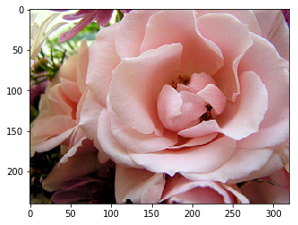
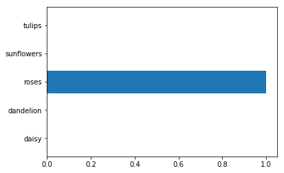

# Transfer Learning

Most of the time you won't want to train a whole convolutional network yourself. Modern ConvNets training on huge datasets like ImageNet take weeks on multiple GPUs. Instead, most people use a pretrained network either as a fixed feature extractor, or as an initial network to fine tune. In this notebook, you'll be using [VGGNet](https://arxiv.org/pdf/1409.1556.pdf) trained on the [ImageNet dataset](http://www.image-net.org/) as a feature extractor. Below is a diagram of the VGGNet architecture.


VGGNet is great because it's simple and has great performance, coming in second in the ImageNet competition. The idea here is that we keep all the convolutional layers, but replace the final fully connected layers with our own classifier. This way we can use VGGNet as a feature extractor for our images then easily train a simple classifier on top of that. What we'll do is take the first fully connected layer with 4096 units, including thresholding with ReLUs. We can use those values as a code for each image, then build a classifier on top of those codes.

You can read more about transfer learning from [the CS231n course notes](http://cs231n.github.io/transfer-learning/#tf).

## Pretrained VGGNet

We'll be using a pretrained network from https://github.com/machrisaa/tensorflow-vgg. Make sure to clone this repository to the directory you're working from. You'll also want to rename it so it has an underscore instead of a dash.

```
git clone https://github.com/machrisaa/tensorflow-vgg.git tensorflow_vgg
```

This is a really nice implementation of VGGNet, quite easy to work with. The network has already been trained and the parameters are available from this link. **You'll need to clone the repo into the folder containing this notebook.** Then download the parameter file using the next cell.


```python
from urllib.request import urlretrieve
from os.path import isfile, isdir
from tqdm import tqdm

vgg_dir = 'tensorflow_vgg/'
# Make sure vgg exists
if not isdir(vgg_dir):
    raise Exception("VGG directory doesn't exist!")

class DLProgress(tqdm):
    last_block = 0

    def hook(self, block_num=1, block_size=1, total_size=None):
        self.total = total_size
        self.update((block_num - self.last_block) * block_size)
        self.last_block = block_num

if not isfile(vgg_dir + "vgg16.npy"):
    with DLProgress(unit='B', unit_scale=True, miniters=1, desc='VGG16 Parameters') as pbar:
        urlretrieve(
            'https://s3.amazonaws.com/content.udacity-data.com/nd101/vgg16.npy',
            vgg_dir + 'vgg16.npy',
            pbar.hook)
else:
    print("Parameter file already exists!")
```

    Parameter file already exists!
    

## Flower power

Here we'll be using VGGNet to classify images of flowers. To get the flower dataset, run the cell below. This dataset comes from the [TensorFlow inception tutorial](https://www.tensorflow.org/tutorials/image_retraining).


```python
import tarfile

dataset_folder_path = 'flower_photos'

class DLProgress(tqdm):
    last_block = 0

    def hook(self, block_num=1, block_size=1, total_size=None):
        self.total = total_size
        self.update((block_num - self.last_block) * block_size)
        self.last_block = block_num

if not isfile('flower_photos.tar.gz'):
    with DLProgress(unit='B', unit_scale=True, miniters=1, desc='Flowers Dataset') as pbar:
        urlretrieve(
            'http://download.tensorflow.org/example_images/flower_photos.tgz',
            'flower_photos.tar.gz',
            pbar.hook)

if not isdir(dataset_folder_path):
    with tarfile.open('flower_photos.tar.gz') as tar:
        tar.extractall()
        tar.close()
```

## ConvNet Codes

Below, we'll run through all the images in our dataset and get codes for each of them. That is, we'll run the images through the VGGNet convolutional layers and record the values of the first fully connected layer. We can then write these to a file for later when we build our own classifier.

Here we're using the `vgg16` module from `tensorflow_vgg`. The network takes images of size $224 \times 224 \times 3$ as input. Then it has 5 sets of convolutional layers. The network implemented here has this structure (copied from [the source code](https://github.com/machrisaa/tensorflow-vgg/blob/master/vgg16.py)):

```
self.conv1_1 = self.conv_layer(bgr, "conv1_1")
self.conv1_2 = self.conv_layer(self.conv1_1, "conv1_2")
self.pool1 = self.max_pool(self.conv1_2, 'pool1')

self.conv2_1 = self.conv_layer(self.pool1, "conv2_1")
self.conv2_2 = self.conv_layer(self.conv2_1, "conv2_2")
self.pool2 = self.max_pool(self.conv2_2, 'pool2')

self.conv3_1 = self.conv_layer(self.pool2, "conv3_1")
self.conv3_2 = self.conv_layer(self.conv3_1, "conv3_2")
self.conv3_3 = self.conv_layer(self.conv3_2, "conv3_3")
self.pool3 = self.max_pool(self.conv3_3, 'pool3')

self.conv4_1 = self.conv_layer(self.pool3, "conv4_1")
self.conv4_2 = self.conv_layer(self.conv4_1, "conv4_2")
self.conv4_3 = self.conv_layer(self.conv4_2, "conv4_3")
self.pool4 = self.max_pool(self.conv4_3, 'pool4')

self.conv5_1 = self.conv_layer(self.pool4, "conv5_1")
self.conv5_2 = self.conv_layer(self.conv5_1, "conv5_2")
self.conv5_3 = self.conv_layer(self.conv5_2, "conv5_3")
self.pool5 = self.max_pool(self.conv5_3, 'pool5')

self.fc6 = self.fc_layer(self.pool5, "fc6")
self.relu6 = tf.nn.relu(self.fc6)
```

So what we want are the values of the first fully connected layer, after being ReLUd (`self.relu6`). To build the network, we use

```
with tf.Session() as sess:
    vgg = vgg16.Vgg16()
    input_ = tf.placeholder(tf.float32, [None, 224, 224, 3])
    with tf.name_scope("content_vgg"):
        vgg.build(input_)
```

This creates the `vgg` object, then builds the graph with `vgg.build(input_)`. Then to get the values from the layer,

```
feed_dict = {input_: images}
codes = sess.run(vgg.relu6, feed_dict=feed_dict)
```


```python
import os

import numpy as np
import tensorflow as tf

from tensorflow_vgg import vgg16
from tensorflow_vgg import utils
```


```python
data_dir = 'flower_photos/'
contents = os.listdir(data_dir)
classes = [each for each in contents if os.path.isdir(data_dir + each)]
print(classes)
```

    ['daisy', 'dandelion', 'roses', 'sunflowers', 'tulips']
    

Below I'm running images through the VGG network in batches.

> **Exercise:** Below, build the VGG network. Also get the codes from the first fully connected layer (make sure you get the ReLUd values).


```python
# Set the batch size higher if you can fit in in your GPU memory
batch_size = 10
codes_list = []
labels = []
batch = []

codes = None

with tf.Session() as sess:
    vgg = vgg16.Vgg16()
    input_ = tf.placeholder(tf.float32, [None, 224, 224, 3])
    with tf.name_scope("content_vgg"):
        vgg.build(input_)
        
    for each in classes:
        print("Starting {} images".format(each))
        class_path = data_dir + each
        files = os.listdir(class_path)
        for ii, file in enumerate(files, 1):
            # Add images to the current batch
            # utils.load_image crops the input images for us, from the center
            img = utils.load_image(os.path.join(class_path, file))
            batch.append(img.reshape((1, 224, 224, 3)))
            labels.append(each)
            
            # Running the batch through the network to get the codes
            if ii % batch_size == 0 or ii == len(files):
                
                # Image batch to pass to VGG network
                images = np.concatenate(batch)
                
                # TODO: Get the values from the relu6 layer of the VGG network
                feed_dict = {input_:images}
                codes_batch = sess.run(vgg.relu6, feed_dict=feed_dict)
                
                # Here I'm building an array of the codes
                if codes is None:
                    codes = codes_batch
                else:
                    codes = np.concatenate((codes, codes_batch))
                
                # Reset to start building the next batch
                batch = []
                print('{} images processed'.format(ii))
```

    C:\Users\lenovo\Desktop\transfer-learning\tensorflow_vgg\vgg16.npy
    npy file loaded
    build model started
    build model finished: 0s
    Starting daisy images
    10 images processed
    20 images processed
    30 images processed
    40 images processed
    50 images processed
    Starting dandelion images
    10 images processed
    20 images processed
    30 images processed
    40 images processed
    50 images processed
    Starting roses images
    10 images processed
    20 images processed
    30 images processed
    40 images processed
    50 images processed
    Starting sunflowers images
    10 images processed
    20 images processed
    30 images processed
    40 images processed
    50 images processed
    Starting tulips images
    10 images processed
    20 images processed
    30 images processed
    40 images processed
    50 images processed
    


```python
sess.close()
```


```python
# write codes to file
with open('codes', 'w') as f:
    codes.tofile(f)
    
# write labels to file
import csv
with open('labels', 'w') as f:
    writer = csv.writer(f, delimiter='\n')
    writer.writerow(labels)
```

## Building the Classifier

Now that we have codes for all the images, we can build a simple classifier on top of them. The codes behave just like normal input into a simple neural network. Below I'm going to have you do most of the work.


```python
# read codes and labels from file
import csv

with open('labels') as f:
    reader = csv.reader(f, delimiter='\n')
    labels = np.array([each for each in reader if len(each) > 0]).squeeze()
with open('codes') as f:
    codes = np.fromfile(f, dtype=np.float32)
    codes = codes.reshape((len(labels), -1))
```

### Data prep

As usual, now we need to one-hot encode our labels and create validation/test sets. First up, creating our labels!

> **Exercise:** From scikit-learn, use [LabelBinarizer](http://scikit-learn.org/stable/modules/generated/sklearn.preprocessing.LabelBinarizer.html) to create one-hot encoded vectors from the labels. 


```python
from sklearn.preprocessing import LabelBinarizer
lb = LabelBinarizer()
lb.fit(labels)
labels_vecs = lb.transform(labels)# Your one-hot encoded labels array here
```


```python
print(labels_vecs)
```

    [[1 0 0 0 0]
     [1 0 0 0 0]
     [1 0 0 0 0]
     ..., 
     [0 0 0 0 1]
     [0 0 0 0 1]
     [0 0 0 0 1]]
    

Now you'll want to create your training, validation, and test sets. An important thing to note here is that our labels and data aren't randomized yet. We'll want to shuffle our data so the validation and test sets contain data from all classes. Otherwise, you could end up with testing sets that are all one class. Typically, you'll also want to make sure that each smaller set has the same the distribution of classes as it is for the whole data set. The easiest way to accomplish both these goals is to use [`StratifiedShuffleSplit`](http://scikit-learn.org/stable/modules/generated/sklearn.model_selection.StratifiedShuffleSplit.html) from scikit-learn.

You can create the splitter like so:
```
ss = StratifiedShuffleSplit(n_splits=1, test_size=0.2)
```
Then split the data with 
```
splitter = ss.split(x, y)
```

`ss.split` returns a generator of indices. You can pass the indices into the arrays to get the split sets. The fact that it's a generator means you either need to iterate over it, or use `next(splitter)` to get the indices. Be sure to read the [documentation](http://scikit-learn.org/stable/modules/generated/sklearn.model_selection.StratifiedShuffleSplit.html) and the [user guide](http://scikit-learn.org/stable/modules/cross_validation.html#random-permutations-cross-validation-a-k-a-shuffle-split).

> **Exercise:** Use StratifiedShuffleSplit to split the codes and labels into training, validation, and test sets.


```python
from sklearn.model_selection import StratifiedShuffleSplit
ss = StratifiedShuffleSplit(n_splits=1, test_size=0.2)

train_idx,val_idx = next(ss.split(codes, labels))

half_val = int(len(val_idx)/2)
val_idx,test_idx = val_idx[:half_val],val_idx[half_val:]

train_x, train_y = codes[train_idx],labels_vecs[train_idx]
val_x, val_y = codes[val_idx],labels_vecs[val_idx]
test_x, test_y =  codes[test_idx],labels_vecs[test_idx]
```


```python
print(train_idx)
```

    [ 89 228   8 217   1 240 196 155  29 116 107 218 120  72  84 169  35 245
     134 129 137 176  61 225  40 171  43  22 105 247  39 154  20 139  33 216
      51 180 109 195 136  85 184 237 199 215  14  60 149 114  48 101 112 239
      15  79  96 145 166 150 117 212  10  34 207 220   7  87 208  57 205 127
     147 167  56 186 210  16  97  36 148 165 203 182  94 202  13 108 153 123
     241 131  42  81 104 230 179 191 119  17  83  32 125 141 238 181  98  66
      58 197 168 122  28  80 100 175 243  92  38  50  86 115 161 151 106 135
      41  64 211  24  47 244 206  27 200 126  78 223  77  74 227  67  19 187
     111  71 194 121  99   5  93  26 231  31 236  18 162 172 174  12 234 235
      30 146 190  82  53 246 242 192 201 102  46 158 209 221  21 110  54   2
     185  55 188 113  37  95 130  62 226 164 132  65 177 189 178 170 219  73
      63  11]
    


```python
print("Train shapes (x, y):", train_x.shape, train_y.shape)
print("Validation shapes (x, y):", val_x.shape, val_y.shape)
print("Test shapes (x, y):", test_x.shape, test_y.shape)
```

    Train shapes (x, y): (200, 4096) (200, 5)
    Validation shapes (x, y): (25, 4096) (25, 5)
    Test shapes (x, y): (25, 4096) (25, 5)
    

If you did it right, you should see these sizes for the training sets:

```
Train shapes (x, y): (2936, 4096) (2936, 5)
Validation shapes (x, y): (367, 4096) (367, 5)
Test shapes (x, y): (367, 4096) (367, 5)
```

### Classifier layers

Once you have the convolutional codes, you just need to build a classfier from some fully connected layers. You use the codes as the inputs and the image labels as targets. Otherwise the classifier is a typical neural network.

> **Exercise:** With the codes and labels loaded, build the classifier. Consider the codes as your inputs, each of them are 4096D vectors. You'll want to use a hidden layer and an output layer as your classifier. Remember that the output layer needs to have one unit for each class and a softmax activation function. Use the cross entropy to calculate the cost.


```python
inputs_ = tf.placeholder(tf.float32, shape=[None, codes.shape[1]])
labels_ = tf.placeholder(tf.int64, shape=[None, labels_vecs.shape[1]])

# TODO: Classifier layers and operations
fc = tf.contrib.layers.fully_connected(inputs_, 256)

logits = tf.contrib.layers.fully_connected(fc, labels_vecs.shape[1],activation_fn=None)
cross_entropy = tf.nn.softmax_cross_entropy_with_logits(logits=logits,labels=labels_)
cost = tf.reduce_mean(cross_entropy)
optimizer = tf.train.AdamOptimizer().minimize(cost)

# Operations for validation/test accuracy
predicted = tf.nn.softmax(logits)
correct_pred = tf.equal(tf.argmax(predicted, 1), tf.argmax(labels_, 1))
accuracy = tf.reduce_mean(tf.cast(correct_pred, tf.float32))
```

### Batches!

Here is just a simple way to do batches. I've written it so that it includes all the data. Sometimes you'll throw out some data at the end to make sure you have full batches. Here I just extend the last batch to include the remaining data.


```python
def get_batches(x, y, n_batches=10):
    """ Return a generator that yields batches from arrays x and y. """
    batch_size = len(x)//n_batches
    
    for ii in range(0, n_batches*batch_size, batch_size):
        # If we're not on the last batch, grab data with size batch_size
        if ii != (n_batches-1)*batch_size:
            X, Y = x[ii: ii+batch_size], y[ii: ii+batch_size] 
        # On the last batch, grab the rest of the data
        else:
            X, Y = x[ii:], y[ii:]
        # I love generators
        yield X, Y
```

### Training

Here, we'll train the network.

> **Exercise:** So far we've been providing the training code for you. Here, I'm going to give you a bit more of a challenge and have you write the code to train the network. Of course, you'll be able to see my solution if you need help. Use the `get_batches` function I wrote before to get your batches like `for x, y in get_batches(train_x, train_y)`. Or write your own!


```python
epochs = 50
iteration = 0
saver = tf.train.Saver()
with tf.Session() as sess:
    
    # TODO: Your training code here
    sess.run(tf.global_variables_initializer())
    
    for e in range(epochs):
        for x, y in get_batches(train_x, train_y, 10):
            feed_dict = {inputs_:x,labels_:y}
            loss ,_ = sess.run([cost, optimizer], feed_dict = feed_dict)
            print('Epoch: {}/{}'.format(e+1,epochs))
            print('Iteration: {}'.format(iteration))
            print("Train loss: {:.5f}".format(loss))
            iteration = iteration + 1
            
            if(iteration % 5 == 0):
                feed_dict = {inputs_:val_x ,labels_:val_y}
                val_acc = sess.run(accuracy, feed_dict = feed_dict)
                print('Epoch: {}/{}'.format(e+1,epochs))
                print('Iteration: {}'.format(iteration))
                print("Validation Acc: {:.5f}".format(val_acc))
    saver.save(sess, "checkpoints/flowers.ckpt")
```

    Epoch: 1/50
    Iteration: 0
    Train loss: 7.13573
    Epoch: 1/50
    Iteration: 1
    Train loss: 19.52498
    Epoch: 1/50
    Iteration: 2
    Train loss: 12.86820
    Epoch: 1/50
    Iteration: 3
    Train loss: 5.95133
    Epoch: 1/50
    Iteration: 4
    Train loss: 2.12128
    Epoch: 1/50
    Iteration: 5
    Validation Acc: 0.80000
    Epoch: 1/50
    Iteration: 5
    Train loss: 2.55750
    Epoch: 1/50
    Iteration: 6
    Train loss: 4.14699
    Epoch: 1/50
    Iteration: 7
    Train loss: 5.62019
    Epoch: 1/50
    Iteration: 8
    Train loss: 3.81729
    Epoch: 1/50
    Iteration: 9
    Train loss: 4.03248
    Epoch: 1/50
    Iteration: 10
    Validation Acc: 0.76000
    Epoch: 2/50
    Iteration: 10
    Train loss: 0.03229
    Epoch: 2/50
    Iteration: 11
    Train loss: 1.88329
    Epoch: 2/50
    Iteration: 12
    Train loss: 0.17240
    Epoch: 2/50
    Iteration: 13
    Train loss: 0.40427
    Epoch: 2/50
    Iteration: 14
    Train loss: 0.17676
    Epoch: 2/50
    Iteration: 15
    Validation Acc: 0.64000
    Epoch: 2/50
    Iteration: 15
    Train loss: 0.00390
    Epoch: 2/50
    Iteration: 16
    Train loss: 1.09832
    Epoch: 2/50
    Iteration: 17
    Train loss: 0.29729
    Epoch: 2/50
    Iteration: 18
    Train loss: 2.03489
    Epoch: 2/50
    Iteration: 19
    Train loss: 0.00586
    Epoch: 2/50
    Iteration: 20
    Validation Acc: 0.64000
    Epoch: 3/50
    Iteration: 20
    Train loss: 0.00117
    Epoch: 3/50
    Iteration: 21
    Train loss: 1.43015
    Epoch: 3/50
    Iteration: 22
    Train loss: 0.00273
    Epoch: 3/50
    Iteration: 23
    Train loss: 0.01052
    Epoch: 3/50
    Iteration: 24
    Train loss: 0.06864
    Epoch: 3/50
    Iteration: 25
    Validation Acc: 0.76000
    Epoch: 3/50
    Iteration: 25
    Train loss: 0.00042
    Epoch: 3/50
    Iteration: 26
    Train loss: 0.13260
    Epoch: 3/50
    Iteration: 27
    Train loss: 0.19728
    Epoch: 3/50
    Iteration: 28
    Train loss: 0.00877
    Epoch: 3/50
    Iteration: 29
    Train loss: 0.00064
    Epoch: 3/50
    Iteration: 30
    Validation Acc: 0.76000
    Epoch: 4/50
    Iteration: 30
    Train loss: 0.00021
    Epoch: 4/50
    Iteration: 31
    Train loss: 0.03744
    Epoch: 4/50
    Iteration: 32
    Train loss: 0.00913
    Epoch: 4/50
    Iteration: 33
    Train loss: 0.05921
    Epoch: 4/50
    Iteration: 34
    Train loss: 0.00834
    Epoch: 4/50
    Iteration: 35
    Validation Acc: 0.80000
    Epoch: 4/50
    Iteration: 35
    Train loss: 0.01339
    Epoch: 4/50
    Iteration: 36
    Train loss: 0.47378
    Epoch: 4/50
    Iteration: 37
    Train loss: 0.00347
    Epoch: 4/50
    Iteration: 38
    Train loss: 0.00004
    Epoch: 4/50
    Iteration: 39
    Train loss: 0.00016
    Epoch: 4/50
    Iteration: 40
    Validation Acc: 0.80000
    Epoch: 5/50
    Iteration: 40
    Train loss: 0.00203
    Epoch: 5/50
    Iteration: 41
    Train loss: 0.00001
    Epoch: 5/50
    Iteration: 42
    Train loss: 0.00002
    Epoch: 5/50
    Iteration: 43
    Train loss: 0.00017
    Epoch: 5/50
    Iteration: 44
    Train loss: 0.00912
    Epoch: 5/50
    Iteration: 45
    Validation Acc: 0.80000
    Epoch: 5/50
    Iteration: 45
    Train loss: 0.00017
    Epoch: 5/50
    Iteration: 46
    Train loss: 0.00072
    Epoch: 5/50
    Iteration: 47
    Train loss: 0.04704
    Epoch: 5/50
    Iteration: 48
    Train loss: 0.00001
    Epoch: 5/50
    Iteration: 49
    Train loss: 0.01068
    Epoch: 5/50
    Iteration: 50
    Validation Acc: 0.80000
    Epoch: 6/50
    Iteration: 50
    Train loss: 0.00029
    Epoch: 6/50
    Iteration: 51
    Train loss: 0.00001
    Epoch: 6/50
    Iteration: 52
    Train loss: 0.00000
    Epoch: 6/50
    Iteration: 53
    Train loss: 0.00021
    Epoch: 6/50
    Iteration: 54
    Train loss: 0.00010
    Epoch: 6/50
    Iteration: 55
    Validation Acc: 0.76000
    Epoch: 6/50
    Iteration: 55
    Train loss: 0.00010
    Epoch: 6/50
    Iteration: 56
    Train loss: 0.00044
    Epoch: 6/50
    Iteration: 57
    Train loss: 0.00093
    Epoch: 6/50
    Iteration: 58
    Train loss: 0.00003
    Epoch: 6/50
    Iteration: 59
    Train loss: 0.00236
    Epoch: 6/50
    Iteration: 60
    Validation Acc: 0.76000
    Epoch: 7/50
    Iteration: 60
    Train loss: 0.00048
    Epoch: 7/50
    Iteration: 61
    Train loss: 0.00003
    Epoch: 7/50
    Iteration: 62
    Train loss: 0.00000
    Epoch: 7/50
    Iteration: 63
    Train loss: 0.00026
    Epoch: 7/50
    Iteration: 64
    Train loss: 0.00004
    Epoch: 7/50
    Iteration: 65
    Validation Acc: 0.76000
    Epoch: 7/50
    Iteration: 65
    Train loss: 0.00009
    Epoch: 7/50
    Iteration: 66
    Train loss: 0.00030
    Epoch: 7/50
    Iteration: 67
    Train loss: 0.00084
    Epoch: 7/50
    Iteration: 68
    Train loss: 0.00004
    Epoch: 7/50
    Iteration: 69
    Train loss: 0.00091
    Epoch: 7/50
    Iteration: 70
    Validation Acc: 0.76000
    Epoch: 8/50
    Iteration: 70
    Train loss: 0.00049
    Epoch: 8/50
    Iteration: 71
    Train loss: 0.00006
    Epoch: 8/50
    Iteration: 72
    Train loss: 0.00000
    Epoch: 8/50
    Iteration: 73
    Train loss: 0.00025
    Epoch: 8/50
    Iteration: 74
    Train loss: 0.00004
    Epoch: 8/50
    Iteration: 75
    Validation Acc: 0.76000
    Epoch: 8/50
    Iteration: 75
    Train loss: 0.00009
    Epoch: 8/50
    Iteration: 76
    Train loss: 0.00022
    Epoch: 8/50
    Iteration: 77
    Train loss: 0.00041
    Epoch: 8/50
    Iteration: 78
    Train loss: 0.00004
    Epoch: 8/50
    Iteration: 79
    Train loss: 0.00051
    Epoch: 8/50
    Iteration: 80
    Validation Acc: 0.76000
    Epoch: 9/50
    Iteration: 80
    Train loss: 0.00033
    Epoch: 9/50
    Iteration: 81
    Train loss: 0.00007
    Epoch: 9/50
    Iteration: 82
    Train loss: 0.00000
    Epoch: 9/50
    Iteration: 83
    Train loss: 0.00022
    Epoch: 9/50
    Iteration: 84
    Train loss: 0.00004
    Epoch: 9/50
    Iteration: 85
    Validation Acc: 0.76000
    Epoch: 9/50
    Iteration: 85
    Train loss: 0.00008
    Epoch: 9/50
    Iteration: 86
    Train loss: 0.00018
    Epoch: 9/50
    Iteration: 87
    Train loss: 0.00024
    Epoch: 9/50
    Iteration: 88
    Train loss: 0.00004
    Epoch: 9/50
    Iteration: 89
    Train loss: 0.00035
    Epoch: 9/50
    Iteration: 90
    Validation Acc: 0.76000
    Epoch: 10/50
    Iteration: 90
    Train loss: 0.00022
    Epoch: 10/50
    Iteration: 91
    Train loss: 0.00006
    Epoch: 10/50
    Iteration: 92
    Train loss: 0.00000
    Epoch: 10/50
    Iteration: 93
    Train loss: 0.00019
    Epoch: 10/50
    Iteration: 94
    Train loss: 0.00003
    Epoch: 10/50
    Iteration: 95
    Validation Acc: 0.76000
    Epoch: 10/50
    Iteration: 95
    Train loss: 0.00008
    Epoch: 10/50
    Iteration: 96
    Train loss: 0.00015
    Epoch: 10/50
    Iteration: 97
    Train loss: 0.00018
    Epoch: 10/50
    Iteration: 98
    Train loss: 0.00004
    Epoch: 10/50
    Iteration: 99
    Train loss: 0.00028
    Epoch: 10/50
    Iteration: 100
    Validation Acc: 0.76000
    Epoch: 11/50
    Iteration: 100
    Train loss: 0.00016
    Epoch: 11/50
    Iteration: 101
    Train loss: 0.00006
    Epoch: 11/50
    Iteration: 102
    Train loss: 0.00000
    Epoch: 11/50
    Iteration: 103
    Train loss: 0.00017
    Epoch: 11/50
    Iteration: 104
    Train loss: 0.00003
    Epoch: 11/50
    Iteration: 105
    Validation Acc: 0.76000
    Epoch: 11/50
    Iteration: 105
    Train loss: 0.00007
    Epoch: 11/50
    Iteration: 106
    Train loss: 0.00013
    Epoch: 11/50
    Iteration: 107
    Train loss: 0.00014
    Epoch: 11/50
    Iteration: 108
    Train loss: 0.00004
    Epoch: 11/50
    Iteration: 109
    Train loss: 0.00023
    Epoch: 11/50
    Iteration: 110
    Validation Acc: 0.76000
    Epoch: 12/50
    Iteration: 110
    Train loss: 0.00012
    Epoch: 12/50
    Iteration: 111
    Train loss: 0.00005
    Epoch: 12/50
    Iteration: 112
    Train loss: 0.00000
    Epoch: 12/50
    Iteration: 113
    Train loss: 0.00015
    Epoch: 12/50
    Iteration: 114
    Train loss: 0.00003
    Epoch: 12/50
    Iteration: 115
    Validation Acc: 0.76000
    Epoch: 12/50
    Iteration: 115
    Train loss: 0.00007
    Epoch: 12/50
    Iteration: 116
    Train loss: 0.00012
    Epoch: 12/50
    Iteration: 117
    Train loss: 0.00012
    Epoch: 12/50
    Iteration: 118
    Train loss: 0.00004
    Epoch: 12/50
    Iteration: 119
    Train loss: 0.00020
    Epoch: 12/50
    Iteration: 120
    Validation Acc: 0.76000
    Epoch: 13/50
    Iteration: 120
    Train loss: 0.00010
    Epoch: 13/50
    Iteration: 121
    Train loss: 0.00004
    Epoch: 13/50
    Iteration: 122
    Train loss: 0.00000
    Epoch: 13/50
    Iteration: 123
    Train loss: 0.00013
    Epoch: 13/50
    Iteration: 124
    Train loss: 0.00003
    Epoch: 13/50
    Iteration: 125
    Validation Acc: 0.76000
    Epoch: 13/50
    Iteration: 125
    Train loss: 0.00006
    Epoch: 13/50
    Iteration: 126
    Train loss: 0.00010
    Epoch: 13/50
    Iteration: 127
    Train loss: 0.00011
    Epoch: 13/50
    Iteration: 128
    Train loss: 0.00003
    Epoch: 13/50
    Iteration: 129
    Train loss: 0.00018
    Epoch: 13/50
    Iteration: 130
    Validation Acc: 0.76000
    Epoch: 14/50
    Iteration: 130
    Train loss: 0.00009
    Epoch: 14/50
    Iteration: 131
    Train loss: 0.00004
    Epoch: 14/50
    Iteration: 132
    Train loss: 0.00000
    Epoch: 14/50
    Iteration: 133
    Train loss: 0.00012
    Epoch: 14/50
    Iteration: 134
    Train loss: 0.00003
    Epoch: 14/50
    Iteration: 135
    Validation Acc: 0.76000
    Epoch: 14/50
    Iteration: 135
    Train loss: 0.00006
    Epoch: 14/50
    Iteration: 136
    Train loss: 0.00010
    Epoch: 14/50
    Iteration: 137
    Train loss: 0.00009
    Epoch: 14/50
    Iteration: 138
    Train loss: 0.00003
    Epoch: 14/50
    Iteration: 139
    Train loss: 0.00017
    Epoch: 14/50
    Iteration: 140
    Validation Acc: 0.76000
    Epoch: 15/50
    Iteration: 140
    Train loss: 0.00008
    Epoch: 15/50
    Iteration: 141
    Train loss: 0.00004
    Epoch: 15/50
    Iteration: 142
    Train loss: 0.00000
    Epoch: 15/50
    Iteration: 143
    Train loss: 0.00011
    Epoch: 15/50
    Iteration: 144
    Train loss: 0.00003
    Epoch: 15/50
    Iteration: 145
    Validation Acc: 0.76000
    Epoch: 15/50
    Iteration: 145
    Train loss: 0.00005
    Epoch: 15/50
    Iteration: 146
    Train loss: 0.00009
    Epoch: 15/50
    Iteration: 147
    Train loss: 0.00009
    Epoch: 15/50
    Iteration: 148
    Train loss: 0.00003
    Epoch: 15/50
    Iteration: 149
    Train loss: 0.00015
    Epoch: 15/50
    Iteration: 150
    Validation Acc: 0.76000
    Epoch: 16/50
    Iteration: 150
    Train loss: 0.00007
    Epoch: 16/50
    Iteration: 151
    Train loss: 0.00003
    Epoch: 16/50
    Iteration: 152
    Train loss: 0.00000
    Epoch: 16/50
    Iteration: 153
    Train loss: 0.00010
    Epoch: 16/50
    Iteration: 154
    Train loss: 0.00003
    Epoch: 16/50
    Iteration: 155
    Validation Acc: 0.76000
    Epoch: 16/50
    Iteration: 155
    Train loss: 0.00005
    Epoch: 16/50
    Iteration: 156
    Train loss: 0.00008
    Epoch: 16/50
    Iteration: 157
    Train loss: 0.00008
    Epoch: 16/50
    Iteration: 158
    Train loss: 0.00003
    Epoch: 16/50
    Iteration: 159
    Train loss: 0.00014
    Epoch: 16/50
    Iteration: 160
    Validation Acc: 0.76000
    Epoch: 17/50
    Iteration: 160
    Train loss: 0.00006
    Epoch: 17/50
    Iteration: 161
    Train loss: 0.00003
    Epoch: 17/50
    Iteration: 162
    Train loss: 0.00000
    Epoch: 17/50
    Iteration: 163
    Train loss: 0.00009
    Epoch: 17/50
    Iteration: 164
    Train loss: 0.00003
    Epoch: 17/50
    Iteration: 165
    Validation Acc: 0.76000
    Epoch: 17/50
    Iteration: 165
    Train loss: 0.00005
    Epoch: 17/50
    Iteration: 166
    Train loss: 0.00008
    Epoch: 17/50
    Iteration: 167
    Train loss: 0.00007
    Epoch: 17/50
    Iteration: 168
    Train loss: 0.00003
    Epoch: 17/50
    Iteration: 169
    Train loss: 0.00013
    Epoch: 17/50
    Iteration: 170
    Validation Acc: 0.76000
    Epoch: 18/50
    Iteration: 170
    Train loss: 0.00005
    Epoch: 18/50
    Iteration: 171
    Train loss: 0.00003
    Epoch: 18/50
    Iteration: 172
    Train loss: 0.00000
    Epoch: 18/50
    Iteration: 173
    Train loss: 0.00008
    Epoch: 18/50
    Iteration: 174
    Train loss: 0.00003
    Epoch: 18/50
    Iteration: 175
    Validation Acc: 0.76000
    Epoch: 18/50
    Iteration: 175
    Train loss: 0.00004
    Epoch: 18/50
    Iteration: 176
    Train loss: 0.00008
    Epoch: 18/50
    Iteration: 177
    Train loss: 0.00007
    Epoch: 18/50
    Iteration: 178
    Train loss: 0.00002
    Epoch: 18/50
    Iteration: 179
    Train loss: 0.00012
    Epoch: 18/50
    Iteration: 180
    Validation Acc: 0.76000
    Epoch: 19/50
    Iteration: 180
    Train loss: 0.00005
    Epoch: 19/50
    Iteration: 181
    Train loss: 0.00003
    Epoch: 19/50
    Iteration: 182
    Train loss: 0.00000
    Epoch: 19/50
    Iteration: 183
    Train loss: 0.00007
    Epoch: 19/50
    Iteration: 184
    Train loss: 0.00002
    Epoch: 19/50
    Iteration: 185
    Validation Acc: 0.76000
    Epoch: 19/50
    Iteration: 185
    Train loss: 0.00004
    Epoch: 19/50
    Iteration: 186
    Train loss: 0.00007
    Epoch: 19/50
    Iteration: 187
    Train loss: 0.00006
    Epoch: 19/50
    Iteration: 188
    Train loss: 0.00002
    Epoch: 19/50
    Iteration: 189
    Train loss: 0.00011
    Epoch: 19/50
    Iteration: 190
    Validation Acc: 0.76000
    Epoch: 20/50
    Iteration: 190
    Train loss: 0.00005
    Epoch: 20/50
    Iteration: 191
    Train loss: 0.00003
    Epoch: 20/50
    Iteration: 192
    Train loss: 0.00000
    Epoch: 20/50
    Iteration: 193
    Train loss: 0.00007
    Epoch: 20/50
    Iteration: 194
    Train loss: 0.00002
    Epoch: 20/50
    Iteration: 195
    Validation Acc: 0.76000
    Epoch: 20/50
    Iteration: 195
    Train loss: 0.00004
    Epoch: 20/50
    Iteration: 196
    Train loss: 0.00007
    Epoch: 20/50
    Iteration: 197
    Train loss: 0.00006
    Epoch: 20/50
    Iteration: 198
    Train loss: 0.00002
    Epoch: 20/50
    Iteration: 199
    Train loss: 0.00011
    Epoch: 20/50
    Iteration: 200
    Validation Acc: 0.76000
    Epoch: 21/50
    Iteration: 200
    Train loss: 0.00004
    Epoch: 21/50
    Iteration: 201
    Train loss: 0.00002
    Epoch: 21/50
    Iteration: 202
    Train loss: 0.00000
    Epoch: 21/50
    Iteration: 203
    Train loss: 0.00006
    Epoch: 21/50
    Iteration: 204
    Train loss: 0.00002
    Epoch: 21/50
    Iteration: 205
    Validation Acc: 0.80000
    Epoch: 21/50
    Iteration: 205
    Train loss: 0.00004
    Epoch: 21/50
    Iteration: 206
    Train loss: 0.00007
    Epoch: 21/50
    Iteration: 207
    Train loss: 0.00005
    Epoch: 21/50
    Iteration: 208
    Train loss: 0.00002
    Epoch: 21/50
    Iteration: 209
    Train loss: 0.00010
    Epoch: 21/50
    Iteration: 210
    Validation Acc: 0.80000
    Epoch: 22/50
    Iteration: 210
    Train loss: 0.00004
    Epoch: 22/50
    Iteration: 211
    Train loss: 0.00002
    Epoch: 22/50
    Iteration: 212
    Train loss: 0.00000
    Epoch: 22/50
    Iteration: 213
    Train loss: 0.00006
    Epoch: 22/50
    Iteration: 214
    Train loss: 0.00002
    Epoch: 22/50
    Iteration: 215
    Validation Acc: 0.80000
    Epoch: 22/50
    Iteration: 215
    Train loss: 0.00004
    Epoch: 22/50
    Iteration: 216
    Train loss: 0.00006
    Epoch: 22/50
    Iteration: 217
    Train loss: 0.00005
    Epoch: 22/50
    Iteration: 218
    Train loss: 0.00002
    Epoch: 22/50
    Iteration: 219
    Train loss: 0.00010
    Epoch: 22/50
    Iteration: 220
    Validation Acc: 0.80000
    Epoch: 23/50
    Iteration: 220
    Train loss: 0.00004
    Epoch: 23/50
    Iteration: 221
    Train loss: 0.00002
    Epoch: 23/50
    Iteration: 222
    Train loss: 0.00000
    Epoch: 23/50
    Iteration: 223
    Train loss: 0.00006
    Epoch: 23/50
    Iteration: 224
    Train loss: 0.00002
    Epoch: 23/50
    Iteration: 225
    Validation Acc: 0.80000
    Epoch: 23/50
    Iteration: 225
    Train loss: 0.00003
    Epoch: 23/50
    Iteration: 226
    Train loss: 0.00006
    Epoch: 23/50
    Iteration: 227
    Train loss: 0.00005
    Epoch: 23/50
    Iteration: 228
    Train loss: 0.00002
    Epoch: 23/50
    Iteration: 229
    Train loss: 0.00009
    Epoch: 23/50
    Iteration: 230
    Validation Acc: 0.80000
    Epoch: 24/50
    Iteration: 230
    Train loss: 0.00004
    Epoch: 24/50
    Iteration: 231
    Train loss: 0.00002
    Epoch: 24/50
    Iteration: 232
    Train loss: 0.00000
    Epoch: 24/50
    Iteration: 233
    Train loss: 0.00005
    Epoch: 24/50
    Iteration: 234
    Train loss: 0.00002
    Epoch: 24/50
    Iteration: 235
    Validation Acc: 0.80000
    Epoch: 24/50
    Iteration: 235
    Train loss: 0.00003
    Epoch: 24/50
    Iteration: 236
    Train loss: 0.00006
    Epoch: 24/50
    Iteration: 237
    Train loss: 0.00005
    Epoch: 24/50
    Iteration: 238
    Train loss: 0.00002
    Epoch: 24/50
    Iteration: 239
    Train loss: 0.00009
    Epoch: 24/50
    Iteration: 240
    Validation Acc: 0.80000
    Epoch: 25/50
    Iteration: 240
    Train loss: 0.00003
    Epoch: 25/50
    Iteration: 241
    Train loss: 0.00002
    Epoch: 25/50
    Iteration: 242
    Train loss: 0.00000
    Epoch: 25/50
    Iteration: 243
    Train loss: 0.00005
    Epoch: 25/50
    Iteration: 244
    Train loss: 0.00002
    Epoch: 25/50
    Iteration: 245
    Validation Acc: 0.80000
    Epoch: 25/50
    Iteration: 245
    Train loss: 0.00003
    Epoch: 25/50
    Iteration: 246
    Train loss: 0.00006
    Epoch: 25/50
    Iteration: 247
    Train loss: 0.00004
    Epoch: 25/50
    Iteration: 248
    Train loss: 0.00002
    Epoch: 25/50
    Iteration: 249
    Train loss: 0.00008
    Epoch: 25/50
    Iteration: 250
    Validation Acc: 0.80000
    Epoch: 26/50
    Iteration: 250
    Train loss: 0.00003
    Epoch: 26/50
    Iteration: 251
    Train loss: 0.00002
    Epoch: 26/50
    Iteration: 252
    Train loss: 0.00000
    Epoch: 26/50
    Iteration: 253
    Train loss: 0.00005
    Epoch: 26/50
    Iteration: 254
    Train loss: 0.00002
    Epoch: 26/50
    Iteration: 255
    Validation Acc: 0.80000
    Epoch: 26/50
    Iteration: 255
    Train loss: 0.00003
    Epoch: 26/50
    Iteration: 256
    Train loss: 0.00006
    Epoch: 26/50
    Iteration: 257
    Train loss: 0.00004
    Epoch: 26/50
    Iteration: 258
    Train loss: 0.00002
    Epoch: 26/50
    Iteration: 259
    Train loss: 0.00008
    Epoch: 26/50
    Iteration: 260
    Validation Acc: 0.80000
    Epoch: 27/50
    Iteration: 260
    Train loss: 0.00003
    Epoch: 27/50
    Iteration: 261
    Train loss: 0.00002
    Epoch: 27/50
    Iteration: 262
    Train loss: 0.00000
    Epoch: 27/50
    Iteration: 263
    Train loss: 0.00004
    Epoch: 27/50
    Iteration: 264
    Train loss: 0.00002
    Epoch: 27/50
    Iteration: 265
    Validation Acc: 0.80000
    Epoch: 27/50
    Iteration: 265
    Train loss: 0.00003
    Epoch: 27/50
    Iteration: 266
    Train loss: 0.00005
    Epoch: 27/50
    Iteration: 267
    Train loss: 0.00004
    Epoch: 27/50
    Iteration: 268
    Train loss: 0.00002
    Epoch: 27/50
    Iteration: 269
    Train loss: 0.00008
    Epoch: 27/50
    Iteration: 270
    Validation Acc: 0.80000
    Epoch: 28/50
    Iteration: 270
    Train loss: 0.00003
    Epoch: 28/50
    Iteration: 271
    Train loss: 0.00002
    Epoch: 28/50
    Iteration: 272
    Train loss: 0.00000
    Epoch: 28/50
    Iteration: 273
    Train loss: 0.00004
    Epoch: 28/50
    Iteration: 274
    Train loss: 0.00002
    Epoch: 28/50
    Iteration: 275
    Validation Acc: 0.80000
    Epoch: 28/50
    Iteration: 275
    Train loss: 0.00003
    Epoch: 28/50
    Iteration: 276
    Train loss: 0.00005
    Epoch: 28/50
    Iteration: 277
    Train loss: 0.00004
    Epoch: 28/50
    Iteration: 278
    Train loss: 0.00002
    Epoch: 28/50
    Iteration: 279
    Train loss: 0.00007
    Epoch: 28/50
    Iteration: 280
    Validation Acc: 0.80000
    Epoch: 29/50
    Iteration: 280
    Train loss: 0.00003
    Epoch: 29/50
    Iteration: 281
    Train loss: 0.00002
    Epoch: 29/50
    Iteration: 282
    Train loss: 0.00000
    Epoch: 29/50
    Iteration: 283
    Train loss: 0.00004
    Epoch: 29/50
    Iteration: 284
    Train loss: 0.00002
    Epoch: 29/50
    Iteration: 285
    Validation Acc: 0.80000
    Epoch: 29/50
    Iteration: 285
    Train loss: 0.00003
    Epoch: 29/50
    Iteration: 286
    Train loss: 0.00005
    Epoch: 29/50
    Iteration: 287
    Train loss: 0.00004
    Epoch: 29/50
    Iteration: 288
    Train loss: 0.00002
    Epoch: 29/50
    Iteration: 289
    Train loss: 0.00007
    Epoch: 29/50
    Iteration: 290
    Validation Acc: 0.80000
    Epoch: 30/50
    Iteration: 290
    Train loss: 0.00003
    Epoch: 30/50
    Iteration: 291
    Train loss: 0.00002
    Epoch: 30/50
    Iteration: 292
    Train loss: 0.00000
    Epoch: 30/50
    Iteration: 293
    Train loss: 0.00004
    Epoch: 30/50
    Iteration: 294
    Train loss: 0.00002
    Epoch: 30/50
    Iteration: 295
    Validation Acc: 0.80000
    Epoch: 30/50
    Iteration: 295
    Train loss: 0.00002
    Epoch: 30/50
    Iteration: 296
    Train loss: 0.00005
    Epoch: 30/50
    Iteration: 297
    Train loss: 0.00003
    Epoch: 30/50
    Iteration: 298
    Train loss: 0.00002
    Epoch: 30/50
    Iteration: 299
    Train loss: 0.00007
    Epoch: 30/50
    Iteration: 300
    Validation Acc: 0.80000
    Epoch: 31/50
    Iteration: 300
    Train loss: 0.00002
    Epoch: 31/50
    Iteration: 301
    Train loss: 0.00002
    Epoch: 31/50
    Iteration: 302
    Train loss: 0.00000
    Epoch: 31/50
    Iteration: 303
    Train loss: 0.00004
    Epoch: 31/50
    Iteration: 304
    Train loss: 0.00002
    Epoch: 31/50
    Iteration: 305
    Validation Acc: 0.80000
    Epoch: 31/50
    Iteration: 305
    Train loss: 0.00002
    Epoch: 31/50
    Iteration: 306
    Train loss: 0.00005
    Epoch: 31/50
    Iteration: 307
    Train loss: 0.00003
    Epoch: 31/50
    Iteration: 308
    Train loss: 0.00001
    Epoch: 31/50
    Iteration: 309
    Train loss: 0.00006
    Epoch: 31/50
    Iteration: 310
    Validation Acc: 0.80000
    Epoch: 32/50
    Iteration: 310
    Train loss: 0.00002
    Epoch: 32/50
    Iteration: 311
    Train loss: 0.00002
    Epoch: 32/50
    Iteration: 312
    Train loss: 0.00000
    Epoch: 32/50
    Iteration: 313
    Train loss: 0.00003
    Epoch: 32/50
    Iteration: 314
    Train loss: 0.00002
    Epoch: 32/50
    Iteration: 315
    Validation Acc: 0.80000
    Epoch: 32/50
    Iteration: 315
    Train loss: 0.00002
    Epoch: 32/50
    Iteration: 316
    Train loss: 0.00005
    Epoch: 32/50
    Iteration: 317
    Train loss: 0.00003
    Epoch: 32/50
    Iteration: 318
    Train loss: 0.00001
    Epoch: 32/50
    Iteration: 319
    Train loss: 0.00006
    Epoch: 32/50
    Iteration: 320
    Validation Acc: 0.80000
    Epoch: 33/50
    Iteration: 320
    Train loss: 0.00002
    Epoch: 33/50
    Iteration: 321
    Train loss: 0.00001
    Epoch: 33/50
    Iteration: 322
    Train loss: 0.00000
    Epoch: 33/50
    Iteration: 323
    Train loss: 0.00003
    Epoch: 33/50
    Iteration: 324
    Train loss: 0.00002
    Epoch: 33/50
    Iteration: 325
    Validation Acc: 0.80000
    Epoch: 33/50
    Iteration: 325
    Train loss: 0.00002
    Epoch: 33/50
    Iteration: 326
    Train loss: 0.00005
    Epoch: 33/50
    Iteration: 327
    Train loss: 0.00003
    Epoch: 33/50
    Iteration: 328
    Train loss: 0.00001
    Epoch: 33/50
    Iteration: 329
    Train loss: 0.00006
    Epoch: 33/50
    Iteration: 330
    Validation Acc: 0.80000
    Epoch: 34/50
    Iteration: 330
    Train loss: 0.00002
    Epoch: 34/50
    Iteration: 331
    Train loss: 0.00001
    Epoch: 34/50
    Iteration: 332
    Train loss: 0.00000
    Epoch: 34/50
    Iteration: 333
    Train loss: 0.00003
    Epoch: 34/50
    Iteration: 334
    Train loss: 0.00002
    Epoch: 34/50
    Iteration: 335
    Validation Acc: 0.80000
    Epoch: 34/50
    Iteration: 335
    Train loss: 0.00002
    Epoch: 34/50
    Iteration: 336
    Train loss: 0.00005
    Epoch: 34/50
    Iteration: 337
    Train loss: 0.00003
    Epoch: 34/50
    Iteration: 338
    Train loss: 0.00001
    Epoch: 34/50
    Iteration: 339
    Train loss: 0.00006
    Epoch: 34/50
    Iteration: 340
    Validation Acc: 0.80000
    Epoch: 35/50
    Iteration: 340
    Train loss: 0.00002
    Epoch: 35/50
    Iteration: 341
    Train loss: 0.00001
    Epoch: 35/50
    Iteration: 342
    Train loss: 0.00000
    Epoch: 35/50
    Iteration: 343
    Train loss: 0.00003
    Epoch: 35/50
    Iteration: 344
    Train loss: 0.00002
    Epoch: 35/50
    Iteration: 345
    Validation Acc: 0.80000
    Epoch: 35/50
    Iteration: 345
    Train loss: 0.00002
    Epoch: 35/50
    Iteration: 346
    Train loss: 0.00005
    Epoch: 35/50
    Iteration: 347
    Train loss: 0.00003
    Epoch: 35/50
    Iteration: 348
    Train loss: 0.00001
    Epoch: 35/50
    Iteration: 349
    Train loss: 0.00005
    Epoch: 35/50
    Iteration: 350
    Validation Acc: 0.80000
    Epoch: 36/50
    Iteration: 350
    Train loss: 0.00002
    Epoch: 36/50
    Iteration: 351
    Train loss: 0.00001
    Epoch: 36/50
    Iteration: 352
    Train loss: 0.00000
    Epoch: 36/50
    Iteration: 353
    Train loss: 0.00003
    Epoch: 36/50
    Iteration: 354
    Train loss: 0.00002
    Epoch: 36/50
    Iteration: 355
    Validation Acc: 0.80000
    Epoch: 36/50
    Iteration: 355
    Train loss: 0.00002
    Epoch: 36/50
    Iteration: 356
    Train loss: 0.00004
    Epoch: 36/50
    Iteration: 357
    Train loss: 0.00003
    Epoch: 36/50
    Iteration: 358
    Train loss: 0.00001
    Epoch: 36/50
    Iteration: 359
    Train loss: 0.00005
    Epoch: 36/50
    Iteration: 360
    Validation Acc: 0.80000
    Epoch: 37/50
    Iteration: 360
    Train loss: 0.00002
    Epoch: 37/50
    Iteration: 361
    Train loss: 0.00001
    Epoch: 37/50
    Iteration: 362
    Train loss: 0.00000
    Epoch: 37/50
    Iteration: 363
    Train loss: 0.00003
    Epoch: 37/50
    Iteration: 364
    Train loss: 0.00002
    Epoch: 37/50
    Iteration: 365
    Validation Acc: 0.80000
    Epoch: 37/50
    Iteration: 365
    Train loss: 0.00002
    Epoch: 37/50
    Iteration: 366
    Train loss: 0.00004
    Epoch: 37/50
    Iteration: 367
    Train loss: 0.00003
    Epoch: 37/50
    Iteration: 368
    Train loss: 0.00001
    Epoch: 37/50
    Iteration: 369
    Train loss: 0.00005
    Epoch: 37/50
    Iteration: 370
    Validation Acc: 0.80000
    Epoch: 38/50
    Iteration: 370
    Train loss: 0.00002
    Epoch: 38/50
    Iteration: 371
    Train loss: 0.00001
    Epoch: 38/50
    Iteration: 372
    Train loss: 0.00000
    Epoch: 38/50
    Iteration: 373
    Train loss: 0.00003
    Epoch: 38/50
    Iteration: 374
    Train loss: 0.00002
    Epoch: 38/50
    Iteration: 375
    Validation Acc: 0.80000
    Epoch: 38/50
    Iteration: 375
    Train loss: 0.00002
    Epoch: 38/50
    Iteration: 376
    Train loss: 0.00004
    Epoch: 38/50
    Iteration: 377
    Train loss: 0.00003
    Epoch: 38/50
    Iteration: 378
    Train loss: 0.00001
    Epoch: 38/50
    Iteration: 379
    Train loss: 0.00005
    Epoch: 38/50
    Iteration: 380
    Validation Acc: 0.80000
    Epoch: 39/50
    Iteration: 380
    Train loss: 0.00002
    Epoch: 39/50
    Iteration: 381
    Train loss: 0.00001
    Epoch: 39/50
    Iteration: 382
    Train loss: 0.00000
    Epoch: 39/50
    Iteration: 383
    Train loss: 0.00003
    Epoch: 39/50
    Iteration: 384
    Train loss: 0.00002
    Epoch: 39/50
    Iteration: 385
    Validation Acc: 0.80000
    Epoch: 39/50
    Iteration: 385
    Train loss: 0.00002
    Epoch: 39/50
    Iteration: 386
    Train loss: 0.00004
    Epoch: 39/50
    Iteration: 387
    Train loss: 0.00002
    Epoch: 39/50
    Iteration: 388
    Train loss: 0.00001
    Epoch: 39/50
    Iteration: 389
    Train loss: 0.00005
    Epoch: 39/50
    Iteration: 390
    Validation Acc: 0.80000
    Epoch: 40/50
    Iteration: 390
    Train loss: 0.00002
    Epoch: 40/50
    Iteration: 391
    Train loss: 0.00001
    Epoch: 40/50
    Iteration: 392
    Train loss: 0.00000
    Epoch: 40/50
    Iteration: 393
    Train loss: 0.00002
    Epoch: 40/50
    Iteration: 394
    Train loss: 0.00002
    Epoch: 40/50
    Iteration: 395
    Validation Acc: 0.80000
    Epoch: 40/50
    Iteration: 395
    Train loss: 0.00002
    Epoch: 40/50
    Iteration: 396
    Train loss: 0.00004
    Epoch: 40/50
    Iteration: 397
    Train loss: 0.00002
    Epoch: 40/50
    Iteration: 398
    Train loss: 0.00001
    Epoch: 40/50
    Iteration: 399
    Train loss: 0.00005
    Epoch: 40/50
    Iteration: 400
    Validation Acc: 0.80000
    Epoch: 41/50
    Iteration: 400
    Train loss: 0.00002
    Epoch: 41/50
    Iteration: 401
    Train loss: 0.00001
    Epoch: 41/50
    Iteration: 402
    Train loss: 0.00000
    Epoch: 41/50
    Iteration: 403
    Train loss: 0.00002
    Epoch: 41/50
    Iteration: 404
    Train loss: 0.00002
    Epoch: 41/50
    Iteration: 405
    Validation Acc: 0.80000
    Epoch: 41/50
    Iteration: 405
    Train loss: 0.00002
    Epoch: 41/50
    Iteration: 406
    Train loss: 0.00004
    Epoch: 41/50
    Iteration: 407
    Train loss: 0.00002
    Epoch: 41/50
    Iteration: 408
    Train loss: 0.00001
    Epoch: 41/50
    Iteration: 409
    Train loss: 0.00005
    Epoch: 41/50
    Iteration: 410
    Validation Acc: 0.80000
    Epoch: 42/50
    Iteration: 410
    Train loss: 0.00002
    Epoch: 42/50
    Iteration: 411
    Train loss: 0.00001
    Epoch: 42/50
    Iteration: 412
    Train loss: 0.00000
    Epoch: 42/50
    Iteration: 413
    Train loss: 0.00002
    Epoch: 42/50
    Iteration: 414
    Train loss: 0.00002
    Epoch: 42/50
    Iteration: 415
    Validation Acc: 0.80000
    Epoch: 42/50
    Iteration: 415
    Train loss: 0.00002
    Epoch: 42/50
    Iteration: 416
    Train loss: 0.00004
    Epoch: 42/50
    Iteration: 417
    Train loss: 0.00002
    Epoch: 42/50
    Iteration: 418
    Train loss: 0.00001
    Epoch: 42/50
    Iteration: 419
    Train loss: 0.00004
    Epoch: 42/50
    Iteration: 420
    Validation Acc: 0.80000
    Epoch: 43/50
    Iteration: 420
    Train loss: 0.00002
    Epoch: 43/50
    Iteration: 421
    Train loss: 0.00001
    Epoch: 43/50
    Iteration: 422
    Train loss: 0.00000
    Epoch: 43/50
    Iteration: 423
    Train loss: 0.00002
    Epoch: 43/50
    Iteration: 424
    Train loss: 0.00002
    Epoch: 43/50
    Iteration: 425
    Validation Acc: 0.80000
    Epoch: 43/50
    Iteration: 425
    Train loss: 0.00002
    Epoch: 43/50
    Iteration: 426
    Train loss: 0.00004
    Epoch: 43/50
    Iteration: 427
    Train loss: 0.00002
    Epoch: 43/50
    Iteration: 428
    Train loss: 0.00001
    Epoch: 43/50
    Iteration: 429
    Train loss: 0.00004
    Epoch: 43/50
    Iteration: 430
    Validation Acc: 0.80000
    Epoch: 44/50
    Iteration: 430
    Train loss: 0.00001
    Epoch: 44/50
    Iteration: 431
    Train loss: 0.00001
    Epoch: 44/50
    Iteration: 432
    Train loss: 0.00000
    Epoch: 44/50
    Iteration: 433
    Train loss: 0.00002
    Epoch: 44/50
    Iteration: 434
    Train loss: 0.00002
    Epoch: 44/50
    Iteration: 435
    Validation Acc: 0.80000
    Epoch: 44/50
    Iteration: 435
    Train loss: 0.00002
    Epoch: 44/50
    Iteration: 436
    Train loss: 0.00004
    Epoch: 44/50
    Iteration: 437
    Train loss: 0.00002
    Epoch: 44/50
    Iteration: 438
    Train loss: 0.00001
    Epoch: 44/50
    Iteration: 439
    Train loss: 0.00004
    Epoch: 44/50
    Iteration: 440
    Validation Acc: 0.80000
    Epoch: 45/50
    Iteration: 440
    Train loss: 0.00001
    Epoch: 45/50
    Iteration: 441
    Train loss: 0.00001
    Epoch: 45/50
    Iteration: 442
    Train loss: 0.00000
    Epoch: 45/50
    Iteration: 443
    Train loss: 0.00002
    Epoch: 45/50
    Iteration: 444
    Train loss: 0.00002
    Epoch: 45/50
    Iteration: 445
    Validation Acc: 0.80000
    Epoch: 45/50
    Iteration: 445
    Train loss: 0.00002
    Epoch: 45/50
    Iteration: 446
    Train loss: 0.00004
    Epoch: 45/50
    Iteration: 447
    Train loss: 0.00002
    Epoch: 45/50
    Iteration: 448
    Train loss: 0.00001
    Epoch: 45/50
    Iteration: 449
    Train loss: 0.00004
    Epoch: 45/50
    Iteration: 450
    Validation Acc: 0.80000
    Epoch: 46/50
    Iteration: 450
    Train loss: 0.00001
    Epoch: 46/50
    Iteration: 451
    Train loss: 0.00001
    Epoch: 46/50
    Iteration: 452
    Train loss: 0.00000
    Epoch: 46/50
    Iteration: 453
    Train loss: 0.00002
    Epoch: 46/50
    Iteration: 454
    Train loss: 0.00001
    Epoch: 46/50
    Iteration: 455
    Validation Acc: 0.80000
    Epoch: 46/50
    Iteration: 455
    Train loss: 0.00001
    Epoch: 46/50
    Iteration: 456
    Train loss: 0.00004
    Epoch: 46/50
    Iteration: 457
    Train loss: 0.00002
    Epoch: 46/50
    Iteration: 458
    Train loss: 0.00001
    Epoch: 46/50
    Iteration: 459
    Train loss: 0.00004
    Epoch: 46/50
    Iteration: 460
    Validation Acc: 0.80000
    Epoch: 47/50
    Iteration: 460
    Train loss: 0.00001
    Epoch: 47/50
    Iteration: 461
    Train loss: 0.00001
    Epoch: 47/50
    Iteration: 462
    Train loss: 0.00000
    Epoch: 47/50
    Iteration: 463
    Train loss: 0.00002
    Epoch: 47/50
    Iteration: 464
    Train loss: 0.00001
    Epoch: 47/50
    Iteration: 465
    Validation Acc: 0.80000
    Epoch: 47/50
    Iteration: 465
    Train loss: 0.00001
    Epoch: 47/50
    Iteration: 466
    Train loss: 0.00004
    Epoch: 47/50
    Iteration: 467
    Train loss: 0.00002
    Epoch: 47/50
    Iteration: 468
    Train loss: 0.00001
    Epoch: 47/50
    Iteration: 469
    Train loss: 0.00004
    Epoch: 47/50
    Iteration: 470
    Validation Acc: 0.80000
    Epoch: 48/50
    Iteration: 470
    Train loss: 0.00001
    Epoch: 48/50
    Iteration: 471
    Train loss: 0.00001
    Epoch: 48/50
    Iteration: 472
    Train loss: 0.00000
    Epoch: 48/50
    Iteration: 473
    Train loss: 0.00002
    Epoch: 48/50
    Iteration: 474
    Train loss: 0.00001
    Epoch: 48/50
    Iteration: 475
    Validation Acc: 0.80000
    Epoch: 48/50
    Iteration: 475
    Train loss: 0.00001
    Epoch: 48/50
    Iteration: 476
    Train loss: 0.00004
    Epoch: 48/50
    Iteration: 477
    Train loss: 0.00002
    Epoch: 48/50
    Iteration: 478
    Train loss: 0.00001
    Epoch: 48/50
    Iteration: 479
    Train loss: 0.00004
    Epoch: 48/50
    Iteration: 480
    Validation Acc: 0.80000
    Epoch: 49/50
    Iteration: 480
    Train loss: 0.00001
    Epoch: 49/50
    Iteration: 481
    Train loss: 0.00001
    Epoch: 49/50
    Iteration: 482
    Train loss: 0.00000
    Epoch: 49/50
    Iteration: 483
    Train loss: 0.00002
    Epoch: 49/50
    Iteration: 484
    Train loss: 0.00001
    Epoch: 49/50
    Iteration: 485
    Validation Acc: 0.80000
    Epoch: 49/50
    Iteration: 485
    Train loss: 0.00001
    Epoch: 49/50
    Iteration: 486
    Train loss: 0.00004
    Epoch: 49/50
    Iteration: 487
    Train loss: 0.00002
    Epoch: 49/50
    Iteration: 488
    Train loss: 0.00001
    Epoch: 49/50
    Iteration: 489
    Train loss: 0.00004
    Epoch: 49/50
    Iteration: 490
    Validation Acc: 0.80000
    Epoch: 50/50
    Iteration: 490
    Train loss: 0.00001
    Epoch: 50/50
    Iteration: 491
    Train loss: 0.00001
    Epoch: 50/50
    Iteration: 492
    Train loss: 0.00000
    Epoch: 50/50
    Iteration: 493
    Train loss: 0.00002
    Epoch: 50/50
    Iteration: 494
    Train loss: 0.00001
    Epoch: 50/50
    Iteration: 495
    Validation Acc: 0.80000
    Epoch: 50/50
    Iteration: 495
    Train loss: 0.00001
    Epoch: 50/50
    Iteration: 496
    Train loss: 0.00003
    Epoch: 50/50
    Iteration: 497
    Train loss: 0.00002
    Epoch: 50/50
    Iteration: 498
    Train loss: 0.00001
    Epoch: 50/50
    Iteration: 499
    Train loss: 0.00004
    Epoch: 50/50
    Iteration: 500
    Validation Acc: 0.80000
    

### Testing

Below you see the test accuracy. You can also see the predictions returned for images.


```python
with tf.Session() as sess:
    saver.restore(sess, tf.train.latest_checkpoint('checkpoints'))
    
    feed = {inputs_: test_x,
            labels_: test_y}
    test_acc = sess.run(accuracy, feed_dict=feed)
    print("Test accuracy: {:.4f}".format(test_acc))
```

    INFO:tensorflow:Restoring parameters from checkpoints\flowers.ckpt
    Test accuracy: 0.6400
    


```python
%matplotlib inline

import matplotlib.pyplot as plt
from scipy.ndimage import imread
```

Below, feel free to choose images and see how the trained classifier predicts the flowers in them.


```python
test_img_path = 'flower_photos/roses/12240303_80d87f77a3_n.jpg'
test_img = plt.imread(test_img_path)
plt.imshow(test_img)
```


    <matplotlib.image.AxesImage at 0x14da4e80>





```python
# Run this cell if you don't have a vgg graph built
if 'vgg' in globals():
    print('"vgg" object already exists.  Will not create again.')
else:
    #create vgg
    with tf.Session() as sess:
        input_ = tf.placeholder(tf.float32, [None, 224, 224, 3])
        vgg = vgg16.Vgg16()
        vgg.build(input_)
```

    "vgg" object already exists.  Will not create again.
    


```python
with tf.Session() as sess:
    img = utils.load_image(test_img_path)
    img = img.reshape((1, 224, 224, 3))

    feed_dict = {input_: img}
    code = sess.run(vgg.relu6, feed_dict=feed_dict)
        
saver = tf.train.Saver()
with tf.Session() as sess:
    saver.restore(sess, tf.train.latest_checkpoint('checkpoints'))
    
    feed = {inputs_: code}
    prediction = sess.run(predicted, feed_dict=feed).squeeze()
```

    INFO:tensorflow:Restoring parameters from checkpoints\flowers.ckpt
    


```python
plt.imshow(test_img)
```


    <matplotlib.image.AxesImage at 0x13ceb438>


```python
plt.barh(np.arange(5), prediction)
_ = plt.yticks(np.arange(5), lb.classes_)
```




